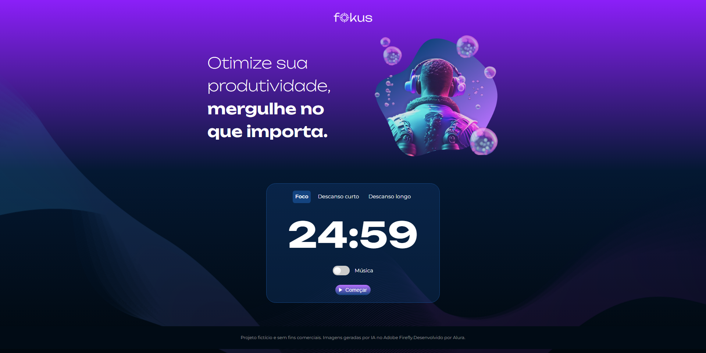
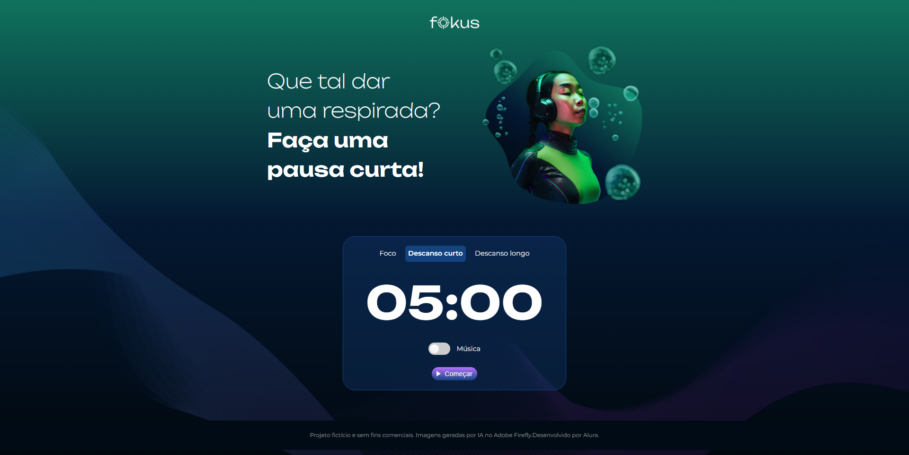

# Fokus

[Fokus Preview](https://gabrielriomar.github.io/Fokus-projeto-base/)

## About

It's just a page to time your focus "pauses" between studies. It comes with 3 different timers

## Technologies

- HTML
- CSS
- JavaScript

## How to use

Clone the project

```bash
git clone https://github.com/GabrielRiomar/Fokus-projeto-base.git
```

### Preview Images

- Foco
  

- Descanso Curto
  

- Descanso Longo
  
